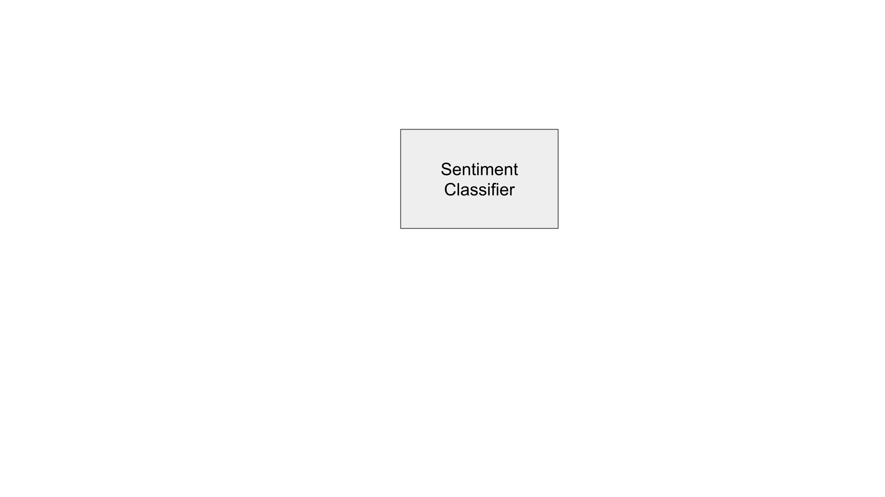
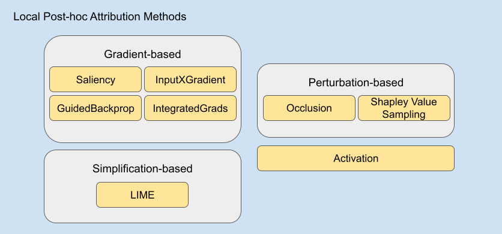

# Background

## Attribution Methods

One way to interpret black-box neural models is to use attribution methods.

Assuming we have a sentiment classifier for movie reviews. 
Attribution methods provide us the knowledge of which part of the input is how much important for the particular decision of the classifier for that input.

In this study, we examine local post-hoc attribution methods which 
provide explanations of the model’s output for a particular input 
by applying additional operations to the model’s prediction.

They can be grouped under 3 categories: gradient-based methods 
that manipulate the gradient of the output with respect to input to 
produce importance scores; perturbation-based methods that 
considers the change in prediction scores after perturbing input in
different ways to produce importance scores; and simplification-based 
ones that use simpler models trained on the local neighborhood of the input.

Apart from these 3 categories, we also cover a simpler attribution method called Activation which utilizes 
hidden layer activations to obtain importance scores.

The following figure shows the methods we covered in this study.

## Evaluating Attribution Methods

### Plausibility

Plausibility is the measure of how much explanations align with 
human reasoning.

### Faithfulness

Faithfulness is a measure of how much the explanation overlaps 
with the model’s inner reasoning mechanism. 

Although there are different ways to measure the faithfulness of 
explanations and explanation methods, erasure-based approaches are 
pretty popular. We can think of such a naive erasure-based approach: 
let’s assume our movie review has importance scores assigned by a 
particular attribution method.  If the words with high scores 
are really important for the specific decision of the classifier, then 
the classifier’s choice should tend to change when some of the most important words are removed. Then we can
quantify the faithfulness of the explanation method by looking at the change 
in decision or confidence of the classifier when important tokens are 
removed.
