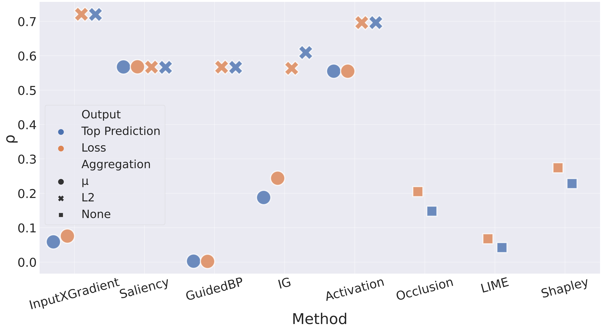
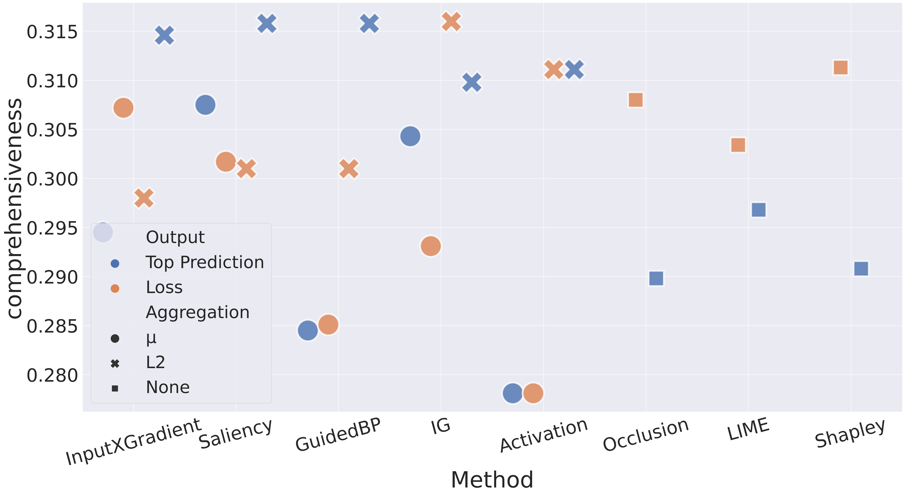
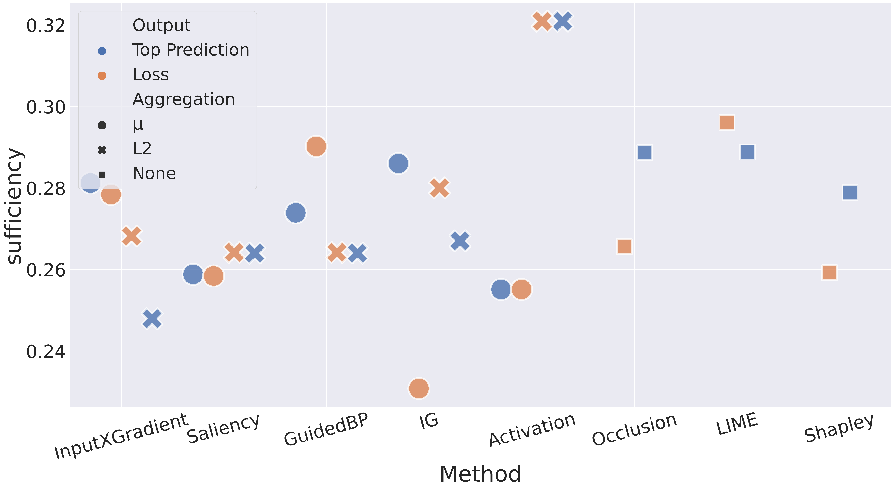
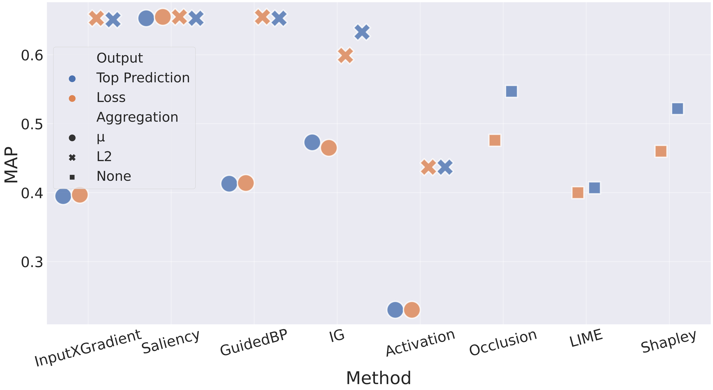

# Experiments

## Faithfulness

### Cross-lingual Faithfulness

#### Results



- InputXGradient is the most faithful method for both output types.
- Gradient-based ones usually generate more faithful attributions than perturbation-based ones.
- L<sub>2</sub> aggregation is better than mean aggregation in almost all cases.

#### Reproducing Experiments

```bash
usage: run_cf.py [-h] [--output {tp,loss}] [--agg {mean,sum,l2}]
                 [--model MODEL] [--alignments ALIGNMENTS]
                 [--alignments-set {best,worst}]
                 [--method {ig,inputxgrad,saliency,activation,guided_bp,shapley,lime,occlusion}]
                 [--device DEVICE] [--batch-size BATCH_SIZE]
                 [--output-dir OUTPUT_DIR] [--n-steps N_STEPS]

Run crosslingual faithfulness experiments

optional arguments:
  -h, --help            show this help message and exit
  --output {tp,loss}    Output mechanism
  --agg {mean,sum,l2}   Aggregation method
  --model MODEL         Path to finetuned model
  --alignments ALIGNMENTS
                        Path to alignments
  --alignments-set {best,worst}
                        Type of alignments whether it is for best or worst
                        performing set of languages
  --method {ig,inputxgrad,saliency,activation,guided_bp,shapley,lime,occlusion}
                        Attribution method
  --device DEVICE       device
  --batch-size BATCH_SIZE
                        Batch size used for attribution calculation,
                        automatically set to 1 for some methods regardless of
                        choice
  --output-dir OUTPUT_DIR
                        Path to directory to save results
  --n-steps N_STEPS     IntegratedGradients number of steps
```

### ERASER Scores

#### Results

##### Comprehensiveness



- When the output is the top prediction score Saliency and GuidedBackprop with L<sub>2</sub> aggregation are the most faithful methods.
- When the output is loss IntegratedGradients with L<sub>2</sub> aggregation is the most faithful method.
- Loss as output usually performs better for non-gradient-based methods.

##### Sufficiency



- InputXGradient with L<sub>2</sub> aggregation and IntegratedGradients with mean aggregation
are the most faithful methods when the output is top prediction score and loss, respectively.
- No clear distinction between aggregation methods and output mechanisms.

#### Reproducing Experiments

```bash
usage: run_eraser.py [-h] [--output {tp,loss}] [--agg {mean,sum,l2}]
                     [--model MODEL]
                     [--method {ig,inputxgrad,saliency,activation,guided_bp,shapley,lime,occlusion}]
                     [--device DEVICE] [--batch-size BATCH_SIZE]
                     [--output-dir OUTPUT_DIR] [--n-steps N_STEPS]

Run ERASER experiments

optional arguments:
  -h, --help            show this help message and exit
  --output {tp,loss}    Output mechanism
  --agg {mean,sum,l2}   Aggregation method
  --model MODEL         Path to finetuned model
  --method {ig,inputxgrad,saliency,activation,guided_bp,shapley,lime,occlusion}
                        Attribution method
  --device DEVICE       device
  --batch-size BATCH_SIZE
                        Batch size used for attribution calculation,
                        automatically set to 1 for some methods regardless of
                        choice
  --output-dir OUTPUT_DIR
                        Path to directory to save results
  --n-steps N_STEPS     IntegratedGradients number of steps
```

### Cross-lingual Faithfulness vs Erasure-based Faithfulness

- Perturbation-based methods show more faithful explanations when evaluated by erasure-based metrics than when evaluated by cross-lingual faithfulness.
- Erasure-based faithfulness metrics fail to properly distinguish between different attribution methods since the differences are dwarfed due to the noise caused by OOD perturbations.


## Plausibility




- GuidedBackprop with L<sub>2</sub> aggregation for the top prediction score as output and 
Saliency with both types of aggregation methods for loss as output are the most plausible methods.
- Gradient-based methods usually generate more plausible explanations than perturbation-based ones.
- Loss as output is mostly better for the non-gradient-based methods.
- L<sub>2</sub> is better than mean aggregation for almost all cases.

### Reproducing Experiments

```bash
usage: run_ha.py [-h] [--output {tp,loss}] [--agg {mean,sum,l2}]
                 [--method {ig,inputxgrad,saliency,activation,guided_bp,shapley,lime,occlusion}]
                 [--model MODEL] [--dataset-dir DATASET_DIR]
                 [--split {dev,test}] [--device DEVICE]
                 [--batch-size BATCH_SIZE] [--output-dir OUTPUT_DIR]
                 [--n-steps N_STEPS]

Run human agreement experiments.

optional arguments:
  -h, --help            show this help message and exit
  --output {tp,loss}    Output mechanism
  --agg {mean,sum,l2}   Aggregation method
  --method {ig,inputxgrad,saliency,activation,guided_bp,shapley,lime,occlusion}
                        Attribution method
  --model MODEL         Path to finetuned model
  --dataset-dir DATASET_DIR
                        Path to the directory in which the e-SNLI dataset
                        exists
  --split {dev,test}    dev/test split
  --device DEVICE       device
  --batch-size BATCH_SIZE
                        Batch size used for attribution calculation,
                        automatically set to 1 for some methods regardless of
                        choice
  --output-dir OUTPUT_DIR
                        Path to directory to save results
  --n-steps N_STEPS     IntegratedGradients number of steps
```
