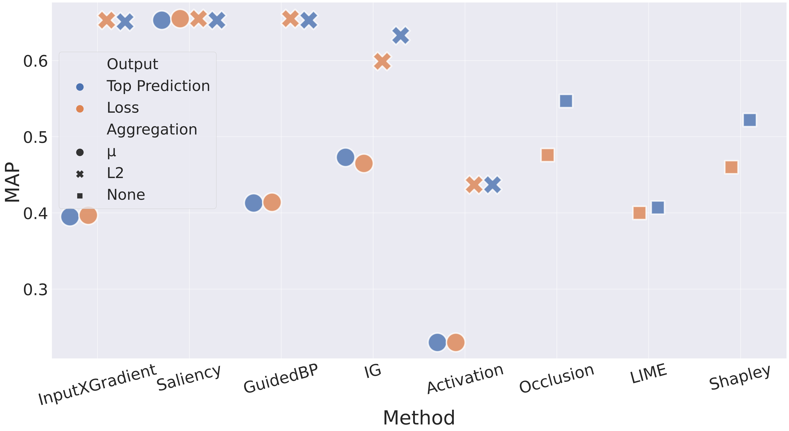

# Plausibility

- GuidedBackprop with L2 aggregation for the top prediction score as output and 
Saliency with both types of aggregation methods for loss as output are the most plausible methods.
- Gradient-based methods usually generate more plausible explanations than perturbation-based ones.
- Loss as output is mostly better for the non-gradient-based methods.
- L2 is better than mean aggregation for almost all cases.
