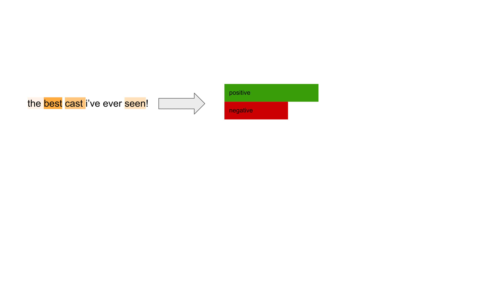

# Faithfulness

## Erasure-based Faithfulness

### Comprehensiveness

Comprehensiveness measures the drop in the output when top-k 
important tokens are removed from the input.

Note a higher score is better for comprehensiveness.

### Sufficiency

Sufficiency measures how sufficient are the important words to 
retain the same decision of the classifier by measuring the drop in 
the output when only top-k tokens are kept.

Note that a lower score is better for sufficiency.

## Cross-lingual Faithfulness

Erasure-based methods come with a drawback. 
What does the model *think* when important words are deleted from input? 

The model thinks it doesn’t have relevant clues to make the same 
decision or to become as confident as last time or does the model have no clue about what this new perturbed input means? A prior study shows that the drop in the prediction confidence might be due to this perturbed input as well because these perturbations form OOD inputs for classifiers.

So, the question is, how can we measure the compatibility of explanation with the model’s inner reasoning mechanism, which is faithfulness in other words, without relying on OOD inputs?

> *On similar inputs, the model makes similar decisions if and only if its reasoning is similar.* (Jacovi and Goldberg, 2020) 

By moving from this assumption, we can use translation pairs that form similar inputs for a multilingual classifier. We see translation pairs as naturally-occurring input perturbations.

Here is how we define and measure cross-lingual faithfulness. Assume we have an English-German translation pair along with a multilingual classifier. We pass inputs from the classifier and use a particular attribution method to obtain scores for each input separately. Since we assume that inputs are similar, attribution scores should also have a similar distribution across words. We cannot directly compare two sequences because they don’t share the same vocabulary. That’s why we need to align scores between translation pairs.

